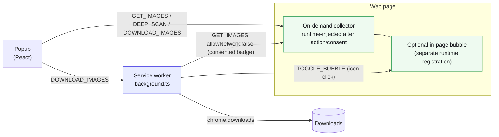

Media Bulk Downloads finds every image, video, and audio file on the page you're
viewing and lets you preview, filter, and download them in bulk — quickly, and
without sending your browsing anywhere. It's a cross-browser Manifest-V3 extension — built for Chrome, Firefox, Edge, and Safari from one codebase; Opera and other Chromium browsers run the Chrome build (Opera and Safari store listings are under review).

## Where to go next

| Guide | What it covers |
|-------|----------------|
| [Quick Start](/media-bulk-downloads/getting-started/quick-start/) | Install, build, load unpacked, first use |
| [Architecture](/media-bulk-downloads/how-it-works/architecture/) | Monorepo layout, the four MV3 surfaces, and the message catalog |

## Workflows

| Guide | Flow |
|-------|------|
| [Collection Pipeline](/media-bulk-downloads/how-it-works/collection-pipeline/) | How page media is discovered, resolved, de-duplicated, and shown |
| [Resolve Originals](/media-bulk-downloads/how-it-works/resolve-originals/) | Opt-in, per-host fetch for the exact original file |
| [Deep Scan](/media-bulk-downloads/guides/deep-scan/) | Opt-in auto-scroll that surfaces virtualized and lazy media |
| [Download & queue](/media-bulk-downloads/guides/download/) | How selected media is named and saved through the service worker |
| [Download paths](/media-bulk-downloads/guides/download-paths/) | Per-site folder templates (`{host}`, `{domain}`, `{date}`, `{kind}`) |
| [Download History](/media-bulk-downloads/guides/history/) | The log of successful downloads: open, reveal, re-download |
| [Favourites](/media-bulk-downloads/guides/favourites/) | The starred-media list and how it persists |
| [Version badge](/media-bulk-downloads/how-it-works/badge/) | The per-tab media count on the toolbar icon |
| [In-page Bubble](/media-bulk-downloads/guides/bubble/) | The injected floating launcher and its lifecycle |

## The four surfaces at a glance

## Design constraints (read before changing collection)

- **Collection is inspection-free until an action or local consent.** A fresh
  install registers no page script. User-initiated and consented badge scans derive
  metadata from the DOM and URL strings only — no `fetch`, `HEAD`, or preload
  while scanning.
- **Explicit features touch the network, never the automatic badge path.**
  Image-size `HEAD` requests run only from a user-opened popup with **Resolve
  Originals** enabled, against images the page already loaded. **Resolve Originals**
  (`resolveOriginals`, off by default) can also
  feature that contacts a host other than the page you're on: when on, the
  background resolves the exact original from one of ~20 supported hosts (Twitter/X,
  Wallhaven, Unsplash, Vimeo, Dailymotion, Bluesky, Pinterest, Reddit, Flickr,
  ArtStation, SoundCloud, Twitch, Loom, PeerTube, and more).
  See [Resolve Originals](/media-bulk-downloads/how-it-works/resolve-originals/) for the full list.
- **Passive request observation is a separate local consent.** The all-site HLS
  observer records manifest URLs only; supported-site sniffers inspect selected
  media API response bodies locally. Raw bodies are never persisted.
- **Deep scan issues no requests of its own.** It scrolls and re-reads the DOM;
  the page loads its own media.
- **URL upgrades are conservative.** Only safe, path-based CDN rewrites. Signed
  URLs (`fbcdn.net`, `cdninstagram.com`) are left byte-identical, and every
  upgrade keeps the pre-upgrade URL as a `thumbnailSrc` fallback.

## See also

- [Collection Benchmark](/media-bulk-downloads/benchmark/overview/) — live, reproducible upgrade measurements
- [Feature one-pager](https://github.com/mralaminahamed/media-bulk-downloads/blob/main/docs/marketing/one-pager.md) — plain-language overview
- [Monorepo restructure](https://github.com/mralaminahamed/media-bulk-downloads/blob/main/docs/architecture/monorepo-restructure.md) — packages/app design record
